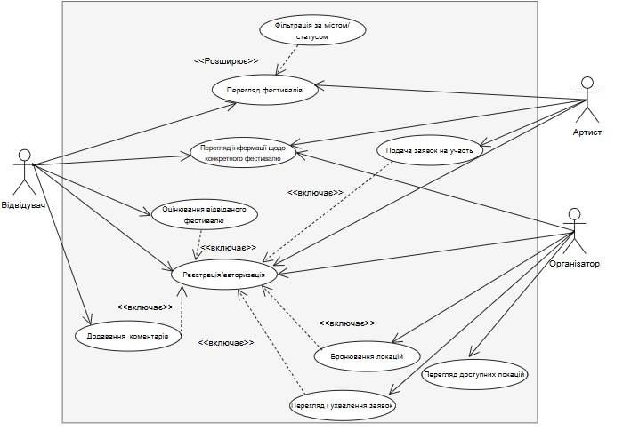
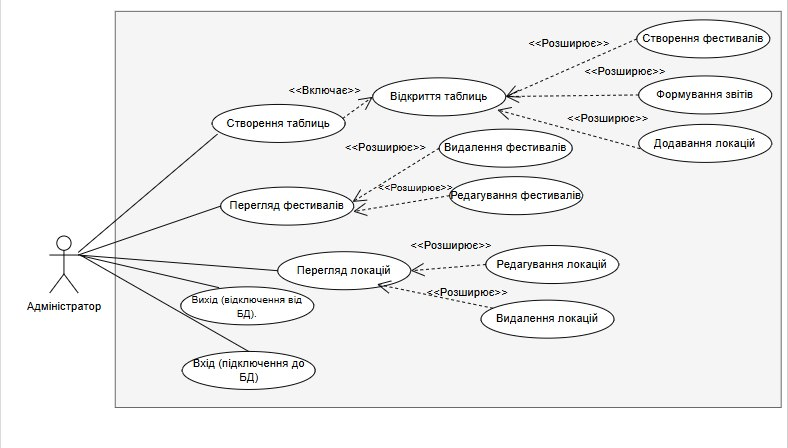
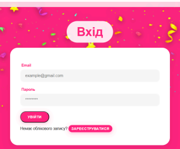
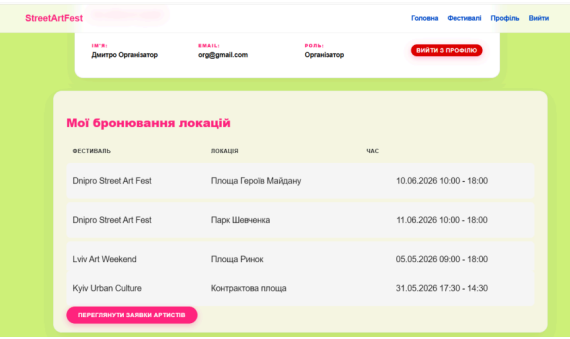
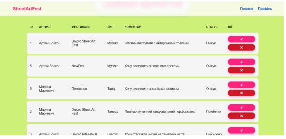
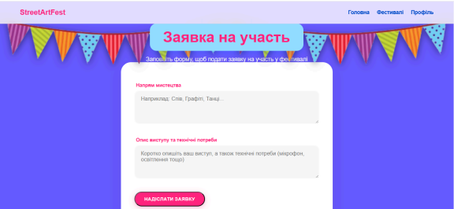
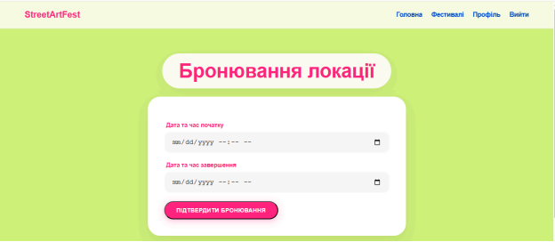

# StreetArtFest

## Festival Management Information System

StreetArtFest is a web application developed to automate the management of street festivals. The system provides convenient tools for managing festivals, locations, events, artist applications, bookings, and visitor reviews.

## Features

* User registration and authentication
* Role-based access (Administrator, Organizer, Artist, Visitor)
* Festival management
* Location management
* Event scheduling
* Artist application management
* Location booking system
* Festival reviews and ratings
* Analytical reports and statistics
* Data validation using SQL triggers
* Stored procedures and database views

## Technologies

* ASP.NET Core MVC
* C#
* Entity Framework Core
* MySQL
* SQL
* HTML5
* CSS3
* JavaScript

## Database

The project uses a MySQL relational database.

Database functionality includes:

* Tables and relationships
* Primary and foreign keys
* Triggers
* Stored Procedures
* Views

## Future Improvements
* Email notifications
* Online ticket purchasing
* Advanced analytics dashboard
* Mobile-friendly interface

## Author

Developed by Anastasiia Petrova.

### Home page

### Reports

### Profile

### Fest Page

### Діаграма варіантів використання системи відвідувачем, артистом та організатором

### Діаграма варіантів використання системи адміністратором

### Сторінка “Вхід”

### Профіль користувача з роллю “Організатор”

### Панель керування заявками артистів

### Подання заявки на участь у фестивалі

### Форма бронювання локації

